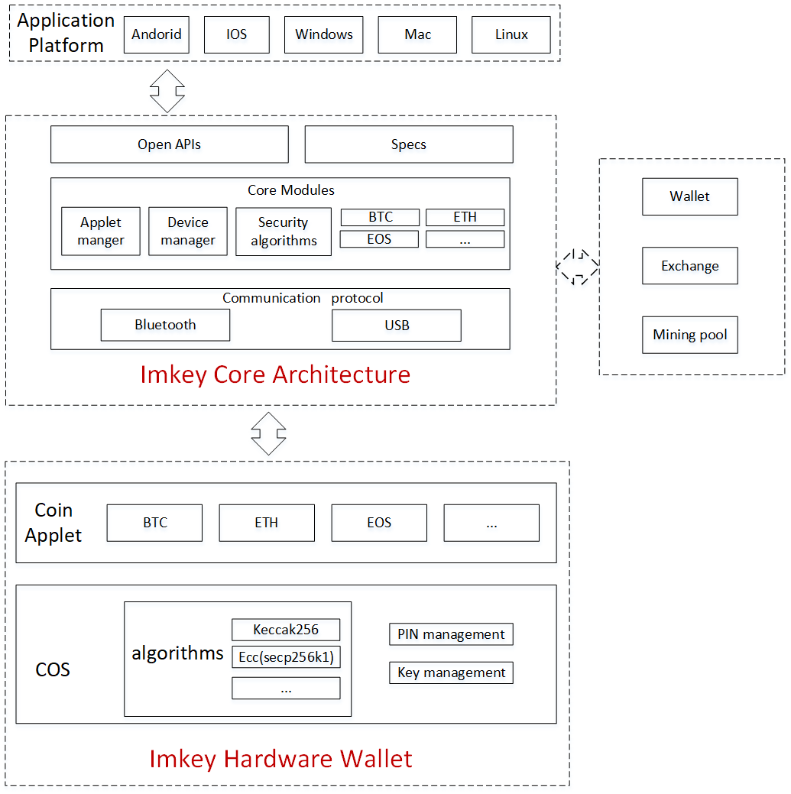
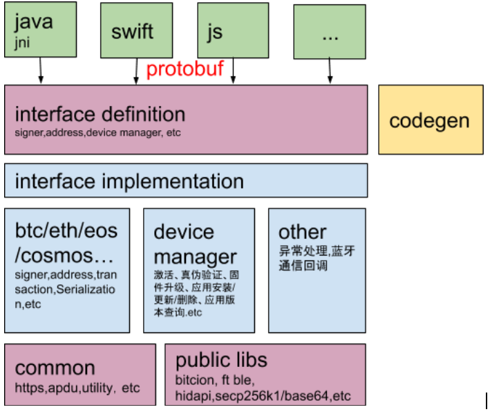

# ImKey Core
ImKey Core是基于imKey安全硬件的，旨在开发专为多链设计的跨平台的方案。

## 总体架构

## 软件架构

### 目录
该项目除了必要的 Rust 代码还包含了部分示例以及多平台编译工具。各自分散在不同的目录下，如下描述了个目录的作用。    
`api`:  核心库对外接口    
`blelibrary`:  imkey蓝牙连接库    
`common`:  通用方法和常量等    
`depend`: 依赖的库（非rust）    
`device`: 设备管理功能库，桥接imKey硬件与后台server    
`docs`: 文档    
`examples`: 核心库的调用示例    
`proto`: protobuf协议接口定义文件及生成rust代码的脚本    
`tools`: 工具库，例如编译脚本、基于proto文件自动生成各语言代码脚本    
`transport`: 数据传输库，根据不同平台来识别数据路由方式（usb、蓝牙）    
`wallet`: 钱包库    

## 关键点设计
### 接口协议
接口数据格式，使用Protobuf协议。Protobuf是Google出品的性能优异、跨语言、跨平台的序列化库。参考：[protocol-buffers](https://developers.google.com/protocol-buffers)

### 接口协议
 imKey指令处理时，只能一条条执行。有些业务，例如btc交易签名，会处理多条指令，且指令之间有关联度，为了防止指令处理混乱导致业务执行错误，采用如下方案限制接口的并发调用：
入口函数初始位置，设置变量加锁控制并发
通过lazy_static库定义，变量API_LOCK，加锁
[lazy_static](https://crates.io/crates/lazy_static)
只有当前线程释放后（return可释放），下个线程才能访问该变量。

### 异常处理
使用[failure库](https://crates.io/crates/failure)    
`外部调用接口顺序`:    
clear_err，清理error信息    
call_imkey_api    
get_last_err_message，获取error信息    
